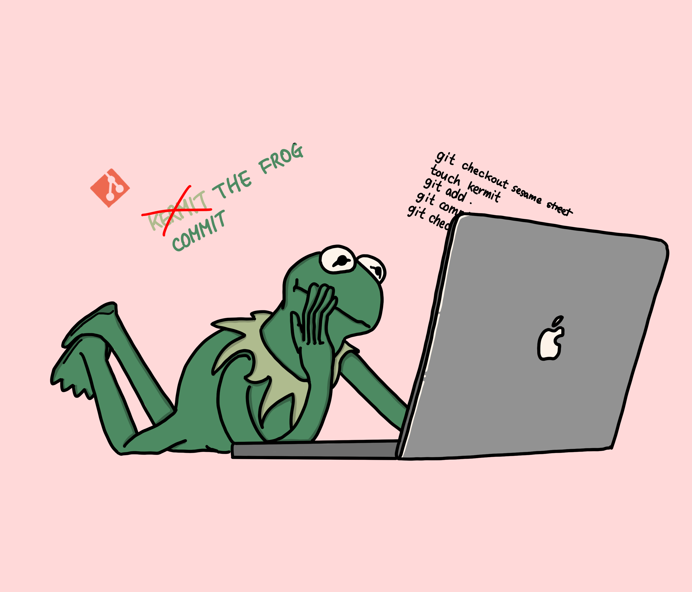

<h1 align="center"> LIKELION AT PUSAN 💭 </h1>

<h2 align="center"><strong>👉 `2nd` FINAL TERM 👈</strong></h2>

 

  
  
  

<h1 align="center"> ️&lt;MEMBERS&gt; </h1>

| [ <b>Tedhoon</b>](https://github.com/tedhoon)         | [ <b>chihun-jang</b>](https://github.com/chihun-jang)  | [ <b>hyerimsn</b>](https://github.com/hyerimsn)           | [ <b>Lim</b>](https://github.com/tbnsok40)  | [ <b>YumYumNyang </b>](https://github.com/YumYumNyang)     | [ <b>nsbg</b>](https://github.com/nsbg) | [ <b>BENJAMIN</b>](https://github.com/jong-myeong)   |
| :-----------------------------------------------------------------------------------------------------------------------------------------------------------------: | :-----------------------------------------------------------------------------------------------------------------------------------------------------------------------: | :-------------------------------------------------------------------------------------------------------------------------------------------------------------------: | :-------------------------------------------------------------------------------------------------------------------------------------------------------------: | :------------------------------------------------------------------------------------------------------------------------------------------------------------: | :---------------------------------------------------------------------------------------------------------------------------------------------------------------------------: | :-----------------------------------------------------------------------------------------------------------------------------------------------------------: |
| [ <b>arimSeo</b>](https://github.com/arimSeo) | [ <b>Jinho</b>](https://github.com/zzzinho) | [ <b>phaesol</b>](https://github.com/phaesol) | [ <b>xxhyowon</b>](https://github.com/xxhyowon) | [ <b>hyunbingil</b>](https://github.com/hyunbingil) | [ <b>k1myum1n</b>](https://github.com/k1myum1n) | [ <b>eunjin917</b>](https://github.com/eunjin917) 
| [ <b>dongyeopca</b>](https://github.com/dongyeopca) | [ <b>minjung2945</b>](https://github.com/minjung2945) | [ <b>songtaeh</b>](https://github.com/songtaeh) | [ <b>mattew8</b>](https://github.com/mattew8) 

# curriculum

- [o] django CBV
- [x] preparing...